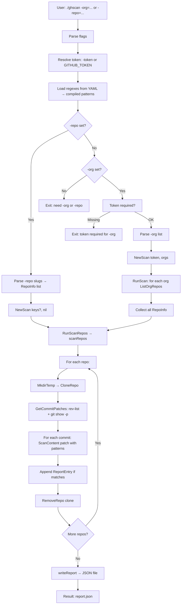

## Flow 

#### Git commit reading phase

The tool does **not** scan the current files on disk. It scans **every commit’s diff** in the repo so it can find secrets that were ever added (even if later removed). This is implemented in `GetCommitPatches(repoDir)` in `git.go`.

| Step | Command / action | Result |
|------|------------------|--------|
| 1 | `git -C <dir> rev-list --all` | List of all commit SHAs (every commit reachable from any branch or tag). |
| 2 | For each SHA: `git -C <dir> show <sha> -p --no-color` | Full **patch** (diff) for that commit: added/removed lines, no ANSI colors. |
| 3 | Store | `[]CommitPatch{SHA, Patch}` — one struct per commit. |
| 4 | (Later) For each patch | `ScanContent(cp.Patch, patterns, commitURL)` runs regexes on the patch text; matches get the commit URL `repo.HTMLURL/commit/<SHA>`. |

- **`rev-list --all`**: enumerates which commits exist (all branches).
- **`git show <sha> -p`**: outputs that commit’s patch (the diff introduced by that commit). `--no-color` keeps output plain text.
- Commits that fail `git show` (e.g. no diff, binary) are skipped; the rest are scanned.
- Each match is tied to a **commit URL** (e.g. `https://github.com/owner/repo/commit/abc123`), not to a single file path.

So in the **git commit reading** phase the tool:

1. **Reads** which commits exist via `git rev-list --all`.
2. **Reads** each commit’s content by getting its **patch** via `git show <sha> -p`.
3. **Scans** that patch text with the loaded regexes and attaches the commit URL to any matches.

---

## Mermaid flowchart

