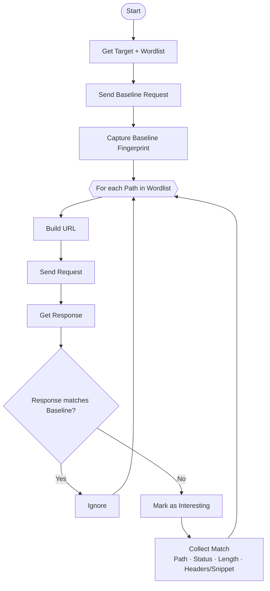

## Flow for Intelligent HTTP Fuzzing

### 0. Setup & input

- **Target**: Base URL (e.g. `https://example.com`)
- **Wordlist**: Paths/payloads to try (e.g. `/admin`, `/backup`, `/api/v1`)
- **Method**: HTTP method (GET default; optionally POST, etc.)
- **Headers**: Optional custom headers (e.g. `User-Agent`, `Cookie`)

---

### 1. Send baseline fingerprint

- Send one or more requests to **known non‑existent paths** (e.g. `/__nonexistent__`, `/404-test-xyz`).
- Record the **baseline response**:
  - Status code (e.g. 404, 403)
  - Response length (bytes)
  - Optional: hash of body or first N bytes
- **Goal**: Know how the target responds when a path does **not** exist, so we can tell “same as baseline” vs “different”.

---

### 2. Send requests with fuzzing paths

- For each entry in the wordlist:
  - Build the full URL (base URL + path).
  - Send the request with the chosen method and headers.
  - Throttle if needed (e.g. delay between requests) to avoid overload/blocking.
  - Record for each request:
    - Path tried
    - Status code
    - Response length
    - Relevant headers (and optionally body hash/sample).

---

### 3. Compare with the baseline fingerprint

- For each fuzzing response, compare against the baseline:
  - **Match baseline** (same status, same length, same key headers) → **Ignore** (likely non‑existent path).
  - **Different from baseline** → **Interesting**; flag for review.
- “Interesting” typically means:
  - Different status (e.g. 200, 301, 302, 403, 500).
  - Different response length (often different content).
  - Different headers (e.g. redirect location, new cookies).

---

### 4. Report interesting findings

- Collect all “interesting” responses.
- For each, store at least:
  - Path
  - Status code
  - Response length
  - Optional: snippet of body or headers.
- Output: console summary and/or report file (e.g. JSON, CSV, or simple text log).

---

### 5. (Optional) Follow redirects & depth

- If following redirects: compare against baseline using the **final** response (after redirects).
- Optional: support path depth (e.g. fuzz `/api/{word}` and `/api/v1/{word}`) by repeating the flow for each base path.

---

## Summary diagram

